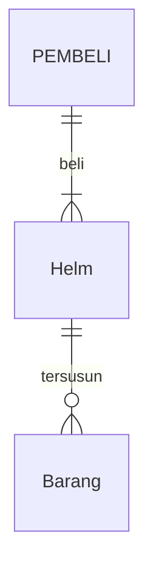
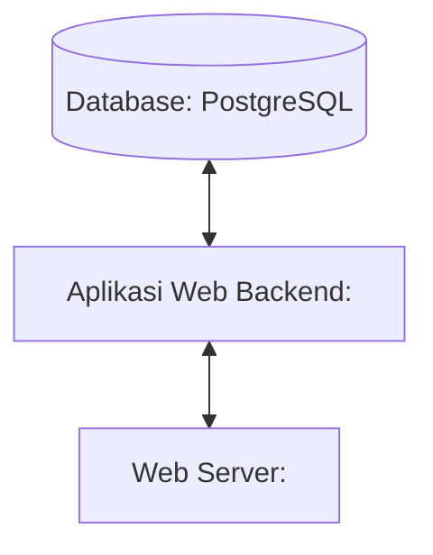

## 1.1 Latar Belakang

SeventyOne MX adalah brand yang menjual berbagai produk seputar motor terutama motocross, yang menawarkan bermacam-macam parts,
apparel, dan aksesoris motocross seperti: helm, sepatu, jersey, wheelset, stang, dan masih banyak lagi. Website ini menawarkan 
kemudahan untuk belanja secara online terutama untuk para penggemar otomotif khususnya di bidang motocross. Website ini bertujuan
untuk memberikan kemudahan dalam kegiatan jual beli yang bisa dilakukan dimanapun dan kapanpun.

## 1.2. Deksripsi Teknologi Informasi

Website SeventyOne MX ini dibuat untuk menjual sebuah barang secara online, di dalamnya terdapat parts dan accessories motocross yang dijual secara online agar pengguna dapat dengan mudah membeli barang dimanapun dan kapanpun. Bertujuan untuk memudahkan kegiatan jual 
beli yang disajikan dalam bentuk website.

## 1.3. Branding

- Merk: SeventyOne MX
- Tagline: Ride in Style, Wear with Pride.
- Campaign: Memberikan kemudahan kepada pengguna dalam belanja yang bisa dilakukan dan di akses dimanapun dan kapanpun secara online.
- Target user:
- Usia 12+
- Seorang yang suka berbelanja seputar motor
- Seorang yang hobi otomotif seperti motocross
- Seorang yang suka memodifikasi motornya
- Seorang yang ingin belanja dengan mudah

Inspirasi Design :
  
  

## 2. User Story

Sebagai | Bisa melakukan | Sehingga | Prioritas
---|---|---|---
Pengguna | Membeli produk | Bisa membeli produk yang diinginkan dengan mudah | ⭐⭐⭐⭐⭐
Pengguna | Mencari produk | Bisa mencari produk yang diinginkan dengan mudah | ⭐⭐⭐⭐⭐
Pengguna | Melihat produk | Bisa melihat gambar dan harga produk | ⭐⭐⭐⭐⭐
Pengguna | Menyaring produk | Bisa mencari produk sesuai kriteria seperti harga nama dll  | ⭐⭐⭐⭐
Pengguna | Melihat detail produk | Bisa melihat detail produk | ⭐⭐⭐⭐⭐
Pengguna | Membuat akun | Bisa membuat akun pengguna | ⭐⭐⭐⭐⭐
Pengguna | Memesan produk | Bisa memesan produk yang diinginkan dengan mudah | ⭐⭐⭐⭐⭐
Pengguna | Memasukan produk | Bisa menambahkan produk yang diinginkan | ⭐⭐⭐⭐⭐
Pengguna | Melacak produk | Bisa melacak produk yang dipesan | ⭐⭐⭐⭐⭐
Pengguna | Memilih produk | Bisa memilih dan menambahkan produk yang akan dibeli | ⭐⭐⭐⭐
Pengguna | Membatalkan pesanan | Bisa membatalkan pesanan jika tidak sesuai | ⭐⭐⭐⭐
Pengguna | Memilih transaksi | Bisa memilih ingin membayar pakai apa | ⭐⭐⭐⭐
Pengguna | Memberikan ulasan | Bisa menuliskan ulasan tentang produk yang dibeli | ⭐⭐⭐⭐
Pengguna | Memberikan saran & kritik | Bisa memberi saran dan kritik | ⭐⭐⭐⭐
Pengguna | Mengembalikan pesanan | Bisa mengembalikan pesanan jika tidak sesuai | ⭐⭐⭐⭐
Pengguna | Menanyakan produk | Bisa bertanya tentang produk yang diinginkan | ⭐⭐⭐⭐
Pengguna | Melihat ulasan | Bisa melihat ulasan produk dari pembeli lain | ⭐⭐⭐⭐
Pengguna | Mengkomplain produk | Bisa mengkomplain produk jika tidak sesuai | ⭐⭐⭐⭐
Admin | Menampilkan produk | Bisa menampilkan produk yang akan dijual | ⭐⭐⭐⭐⭐
Admin | Menampilkan harga produk | Bisa menampilkan harga produk yang akan dijual | ⭐⭐⭐⭐
Admin | Menampilkan nama produk | Bisa menampilkan nama produk yang akan dijual | ⭐⭐⭐⭐⭐
Admin | Menampilkan deskripsi produk | Bisa menampilkan deskripsi produk yang akan dijual | ⭐⭐⭐⭐
Admin | Menampilkan size produk | Bisa menampilkan size produk yang akan dijual | ⭐⭐⭐⭐⭐
Admin | Menampilkan stok produk | Bisa menampilkan stok produk yang akan dijual | ⭐⭐⭐⭐
Admin | Menampilkan warna produk | Bisa menampilkan pilihan warna produk yang akan dijual | ⭐⭐⭐⭐⭐
Admin | Menampilkan kategori produk | Bisa menampilkan kategori produk yang akan dijual | ⭐⭐⭐⭐
Admin | Menampilkan deskripsi produk | Bisa menampilkan deskripsi produk yang akan dijual | ⭐⭐⭐⭐⭐
Admin | Menampilkan jenis produk | Bisa menampilkan jenis produk yang akan dijual | ⭐⭐⭐⭐
Admin | Menampilkan sistem pembayaran | Bisa menampilkan sistem pembayaran yang bisa dipakai | ⭐⭐⭐⭐⭐
Admin | Menampilkan status produk | Bisa menampilkan status ready atau tidaknya produk yang akan dijual | ⭐⭐⭐⭐
Admin | Menampilkan jasa pengiriman | Bisa menampilkan jasa pengiriman yang dipakai | ⭐⭐⭐⭐
Admin | Menampilkan status pengiriman | Bisa menampilkan status pengiriman produk yang dibeli | ⭐⭐⭐⭐
Admin | Menampilkan ulasan pembeli | Bisa menampilkan ulasan yang dikirim oleh pembeli | ⭐⭐⭐⭐
Admin | Menampilkan jumlah barang yang dibeli | Bisa menampilkan jumlah barang yang sudah dibeli | ⭐⭐⭐⭐
Admin | Menampilkan pesan pembeli | Bisa menampilkan pesan yang dikirim pembeli | ⭐⭐⭐⭐
Admin | Menampilkan rute pengiriman | Bisa menampilkan rute pengiriman antara barang dan tujuan pengiriman | ⭐⭐⭐⭐
Admin | Menampilkan alamat toko SMX | Bisa menampilkan alamat toko SeventyOne MX | ⭐⭐⭐⭐
Admin | Menampilkan akun pengguna | Bisa menampilkan akun pengguna atau pembeli | ⭐⭐⭐⭐
Admin | Menampilkan menampilkan produk | Bisa menampilkan produk yang dicari | ⭐⭐⭐⭐
Admin | Menampilkan alamat pembeli | Bisa menampilkan alamat pengguna atau pembeli saat membeli barang | ⭐⭐⭐⭐
Admin | Menampilkan kontak toko | Bisa menampilkan nomor telepon toko | ⭐⭐⭐⭐
Admin | Menampilkan social media | Bisa menampilkan akun social media toko | ⭐⭐⭐⭐
Admin | Menampilkan tentang SMX | Bisa menampilkan deskripsi tentang SeventyOne MX | ⭐⭐⭐⭐
Admin | Menampilkan layanan pelanggan | Bisa menampilkan layanan pelanggan | ⭐⭐⭐⭐

## 3. Struktur Data

## 4. Arsitektur Sistem

## 5. Teknologi, Library, dan Framework

- UI/UX Design : Figma
- Web Server : 
- Text Editor : VS Code
- Browser : Chrome
- Library : 
- Framework : 
- Database : PostgreSQL
  
## 6. Desain User Experience dan User Interface

## 7. Demonstrasi Video

Link youtube nya

## 8. Bagaimana mesin komputasi dan sistem operasi berperan dalam produk teknologi informasimu ?

Link youtube nya di detik jawaban ini

## 9. Bagaimana algoritma, struktur data, dan bahasa pemrograman berperan dalam produk teknologi informasimu ?

Link youtube nya di detik jawaban ini

## 10. Bagaimana metode pengembangan perangkat lunak / Software Development Life Cycle berperan dalam produk teknologi informasimu ?

Link youtube nya di detik jawaban ini

## 11. Bagaimana database / sistem basis data berperan dalam produk teknologi informasimu ?

Link youtube nya di detik jawaban ini
