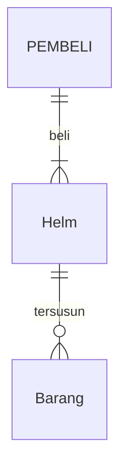
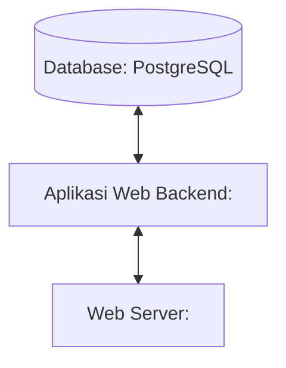

## 1.1 Latar Belakang

SeventyOne MX adalah brand yang menjual berbagai produk seputar motor terutama motocross, yang menawarkan bermacam-macam parts,
apparel, dan aksesoris motocross seperti: helm, sepatu, jersey, wheelset, stang, dan masih banyak lagi. Website ini menawarkan 
kemudahan untuk belanja secara online terutama untuk para penggemar otomotif khususnya di bidang motocross. Website ini bertujuan
untuk memberikan kemudahan dalam kegiatan jual beli yang bisa dilakukan dimanapun dan kapanpun.

## 1.2. Deksripsi Teknologi Informasi

Website SeventyOne MX ini dibuat untuk menjual sebuah barang secara online, di dalamnya terdapat parts dan accessories motocross yang dijual secara online agar pengguna dapat dengan mudah membeli barang dimanapun dan kapanpun. Bertujuan untuk memudahkan kegiatan jual 
beli yang disajikan dalam bentuk website.

## 1.3. Branding

- Merk: SeventyOne MX
- Tagline: Ride in Style, Wear with Pride.
- Campaign: Memberikan kemudahan kepada pengguna dalam belanja yang bisa dilakukan dan di akses dimanapun dan kapanpun secara online.
- Target user:
- Usia 12+
- Seorang yang suka berbelanja seputar motor
- Seorang yang hobi otomotif seperti motocross
- Seorang yang suka memodifikasi motornya
- Seorang yang ingin belanja dengan mudah
  Inspirasi Design
  

## 2. User Story

Sebagai | Bisa melakukan | Sehingga | Prioritas
---|---|---|---
Pengguna | Membeli produk | Bisa membeli produk yang diinginkan dengan mudah | ⭐⭐⭐⭐⭐
Pengguna | Mencari produk | Bisa mencari produk yang diinginkan dengan mudah | ⭐⭐⭐⭐⭐
Pengguna | Melihat produk | Bisa melihat gambar dan harga produk | ⭐⭐⭐⭐⭐
## 3. Struktur Data

## 4. Arsitektur Sistem

## 5. Teknologi, Library, dan Framework

- UI/UX Design : Figma
- Web Server : 
- Text Editor : VS Code
- Browser : Chrome
- Library : 
- Framework : 
- Database : PostgreSQL
  
## 6. Desain User Experience dan User Interface

## 7. Demonstrasi Video

Link youtube nya

## 8. Bagaimana mesin komputasi dan sistem operasi berperan dalam produk teknologi informasimu ?

Link youtube nya di detik jawaban ini

## 9. Bagaimana algoritma, struktur data, dan bahasa pemrograman berperan dalam produk teknologi informasimu ?

Link youtube nya di detik jawaban ini

## 10. Bagaimana metode pengembangan perangkat lunak / Software Development Life Cycle berperan dalam produk teknologi informasimu ?

Link youtube nya di detik jawaban ini

## 11. Bagaimana database / sistem basis data berperan dalam produk teknologi informasimu ?

Link youtube nya di detik jawaban ini
