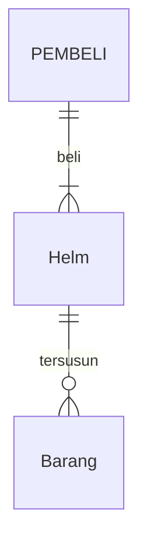
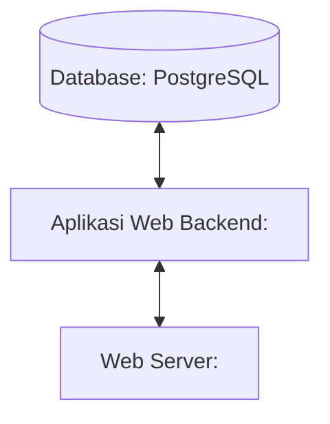

## 1.1 Latar Belakang

Saya membuat website e-commerce sebuah brand yang bernama SeventyOne MX dimana pengguna dapat melihat dan membeli sebuah barang secara online.
SeventyOne MX adalah sebuah brand yang menjual berbagai parts, apparel dan accesories motocross, di dalamnya terdapat macam-macam produk seputar
motocross yang menawarkan pengguna untuk membeli barang tersebut melalui website yang bisa di akses dimanapun dan kapanpun sehingga pengguna dapat
membeli dengan mudah. Saya membuat brand dan website ini karena hobi saya dalam bidang otomotif terutama motocross.

## 1.2. Deksripsi Teknologi Informasi

Website SeventyOne MX ini dibuat untuk menjual sebuah barang secara online, di dalamnya terdapat parts dan accessories motocross yang dijual secara online agar pengguna dapat dengan mudah membeli barang dimanapun dan kapanpun. Bertujuan untuk memudahkan kegiatan jual 
beli yang disajikan dalam bentuk website.

## 1.3. Branding

- Merk: SeventyOne MX
- Tagline: Ride in Style, Wear with Pride.
- Campaign: Memberikan kemudahan kepada pengguna dalam belanja yang bisa dilakukan dan di akses dimanapun dan kapanpun secara online.
- Target user:
- Usia 12+
- Seorang yang suka berbelanja seputar motor
- Seorang yang hobi otomotif seperti motocross
- Seorang yang suka memodifikasi motornya
- Seorang yang ingin belanja dengan mudah

## 2. User Story

Sebagai | Bisa melakukan | Sehingga | Prioritas
---|---|---|---
Pengguna | Membeli produk | Bisa membeli produk yang diinginkan dengan mudah | ⭐⭐⭐⭐⭐
Pengguna | Mencari produk | Bisa menncari produk yang diinginkan dengan mudah | ⭐⭐⭐⭐⭐
Pengguna | Melihat produk | Bisa melihat gambar dan harga produk | ⭐⭐⭐⭐⭐
## 3. Struktur Data

## 4. Arsitektur Sistem

## 5. Teknologi, Library, dan Framework

- UI/UX Design : Figma
- Web Server : 
- Text Editor : VS Code
- Browser : Chrome
- Library : 
- Framework : 
- Database : PostgreSQL
  
## 6. Desain User Experience dan User Interface

Bisa load image 

## 7. Demonstrasi Video

Link youtube nya

## 8. Bagaimana mesin komputasi dan sistem operasi berperan dalam produk teknologi informasimu ?

Link youtube nya di detik jawaban ini

## 9. Bagaimana algoritma, struktur data, dan bahasa pemrograman berperan dalam produk teknologi informasimu ?

Link youtube nya di detik jawaban ini

## 10. Bagaimana metode pengembangan perangkat lunak / Software Development Life Cycle berperan dalam produk teknologi informasimu ?

Link youtube nya di detik jawaban ini

## 11. Bagaimana database / sistem basis data berperan dalam produk teknologi informasimu ?

Link youtube nya di detik jawaban ini
